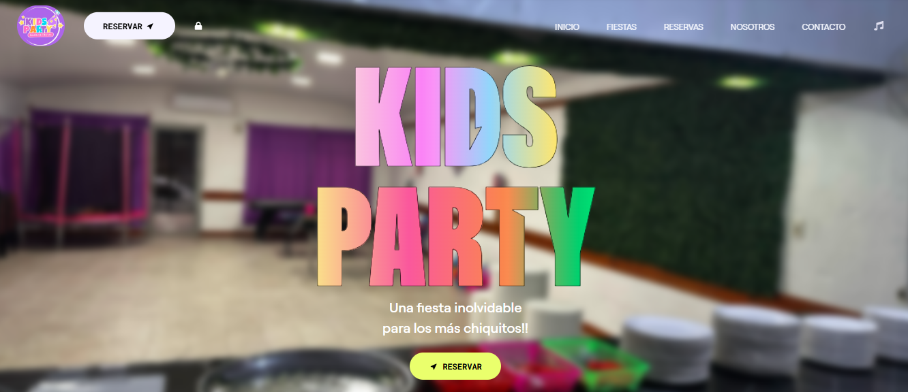

# 🎉 Kids Party

**Kids Party** es una aplicación web full-stack para gestionar reservas de un salón de fiestas infantiles. Desarrollada con **ReactJS** y **TailwindCSS** en el frontend, y con **Node.js**, **ExpressJS** y **MongoDB Atlas** en el backend. Este sistema permite a los usuarios crear, visualizar y gestionar sus eventos desde cualquier dispositivo de forma sencilla y segura.

---

## 📚 Tabla de Contenido

- [🚀 Tecnologías](#-tecnologías)
- [⚙️ Arquitectura](#️-arquitectura)
- [🖼️ Vista Previa](#️-vista-previa)
- [📁 Estructura del Proyecto](#-estructura-del-proyecto)
- [🛠️ Instalación Local](#️-instalación-local)
- [🌐 Variables de Entorno](#-variables-de-entorno)
- [📦 Build y Deploy](#-build-y-deploy)
- [✅ Funcionalidades](#-funcionalidades)
- [📌 Mejoras Futuras](#-mejoras-futuras)
- [🤝 Contribuciones](#-contribuciones)
- [📄 Licencia](#-licencia)
- [👨‍💻 Autor](#-autor)

---

## 🚀 Tecnologías

### Frontend:
- ⚛️ [ReactJS](https://react.dev/)
- ⚡️ [Vite](https://vitejs.dev/)
- 🎨 [Tailwind CSS](https://tailwindcss.com/)

### Backend:
- 🟢 [Node.js](https://nodejs.org/)
- 🔧 [ExpressJS](https://expressjs.com/)
- 🍃 [MongoDB Atlas](https://www.mongodb.com/cloud/atlas)

---

## ⚙️ Arquitectura


---

## 🖼️ Vista Previa



> *Puedes ver una demo en vivo aquí:* [https://kids-party.vercel.app](https://kids-party.vercel.app)

---

## 📁 Estructura del Proyecto

```bash
KidsParty/
├── client/              # Frontend con Vite + React + Tailwind
│   ├── src/
│   │   ├── assets/
│   │   ├── components/
│   │   ├── pages/
│   │   ├── App.tsx
│   │   └── main.tsx
│   ├── index.html
│   └── tailwind.config.js
│
├── server/              # Backend con Node + Express
│   ├── controllers/
│   ├── models/
│   ├── routes/
│   ├── config/
│   ├── server.js
│   └── .env
│
├── .gitignore
├── README.md
└── package.json
